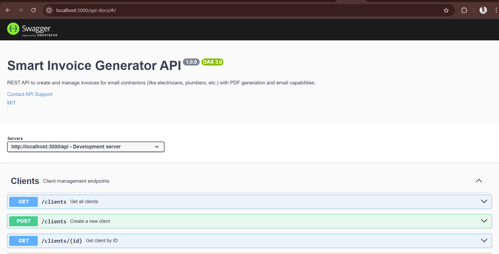
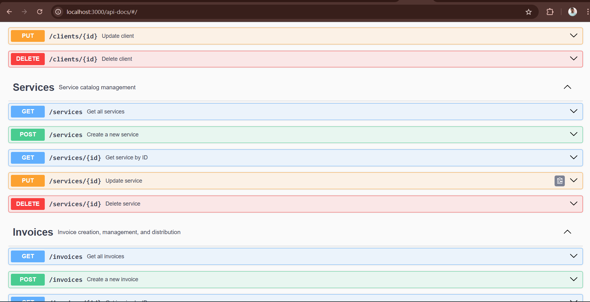
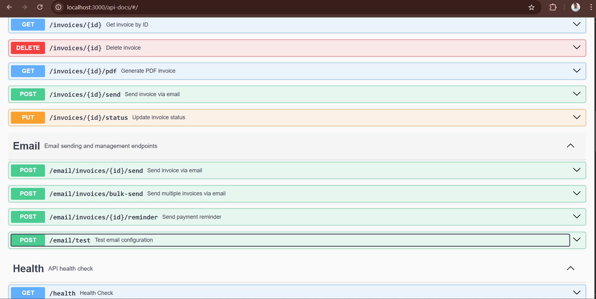
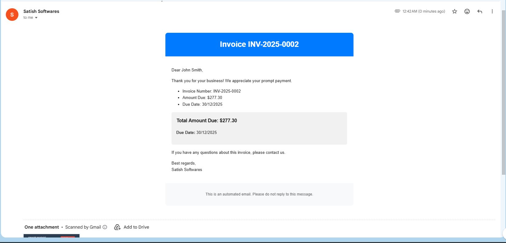
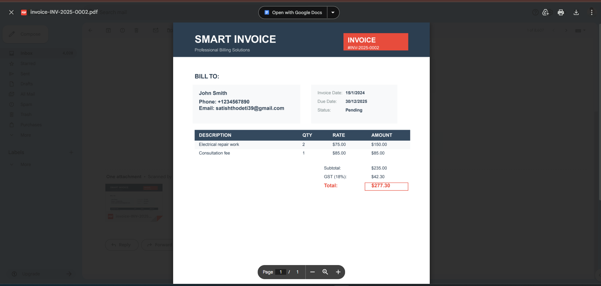

# 🧾 Smart Invoice Generator API

A comprehensive REST API for creating and managing invoices for small contractors (electricians, plumbers, etc.) with automated PDF generation and email capabilities.

## ✨ Features

- **📋 CRUD Operations** - Full management of clients, services, and invoices
- **🧮 Auto Calculations** - Automatic subtotal, GST, and total amount calculations
- **📄 PDF Generation** - Professional invoice PDF generation with pdfkit
- **📧 Email Integration** - Send invoices via email with Nodemailer
- **💾 PostgreSQL Database** - Robust data storage with raw pg Pool (no ORM)
- **📚 Swagger Documentation** - Complete API documentation with OpenAPI 3.0
- **🔄 Transaction Support** - ACID compliance for invoice operations

## 🛠 Tech Stack

- **Backend**: Node.js, Express.js
- **Database**: PostgreSQL with pg Pool
- **PDF Generation**: pdfkit
- **Email**: Nodemailer
- **Documentation**: Swagger/OpenAPI 3.0
- **Environment**: dotenv

## 📋 Prerequisites

- Node.js (v14 or higher)
- PostgreSQL (v12 or higher)
- npm or yarn

## 🚀 Quick Start

### 1. Clone and Install

```bash
git clone https://github.com/satishthodeti/smart-invoice-api
cd smart-invoice-api
npm install
```

### 2. Database Setup

```bash
# Create and setup database
psql -U your_username -d postgres -f database/schema.sql
```

### 3. Environment Configuration

Create `.env` file:

```env
# Server
PORT=3000

# Database
DB_HOST=localhost
DB_PORT=5432
DB_NAME=invoice_generator
DB_USER=your_username
DB_PASSWORD=your_password

# Email Configuration
EMAIL_HOST=smtp.gmail.com
EMAIL_PORT=587
EMAIL_USER=your-email@gmail.com
EMAIL_PASS=your-app-password
COMPANY_NAME=Your Company Name

# GST Configuration
GST_RATE=18
```

### 4. Start the Server

```bash
# Development
npm run dev

# Production
npm start
```

## 📁 Project Structure

```
smart-invoice-api/
├── config/
│   └── database.js          # PostgreSQL configuration
├── controllers/
│   ├── clientController.js  # Client business logic
│   ├── serviceController.js # Service business logic
│   ├── invoiceController.js # Invoice business logic
│   └── emailController.js   # Email business logic
├── models/
│   ├── clientModel.js       # Client data operations
│   ├── serviceModel.js      # Service data operations
│   └── invoiceModel.js      # Invoice data operations
├── routes/
│   ├── clients.js           # Client routes
│   ├── services.js          # Service routes
│   ├── invoices.js          # Invoice routes
│   └── email.js             # Email routes
├── utils/
│   ├── pdfGenerator.js      # PDF generation utilities
│   └── emailService.js      # Email service utilities
├── database/
│   └── schema.sql           # Database schema and seed data
├── swagger.json         # API documentation
├── app.js                   # Main application file
└── README.md
```

## 🗄 Database Schema

### Tables
- **clients** - Customer information
- **services** - Service catalog with rates
- **invoices** - Invoice headers with totals
- **invoice_items** - Invoice line items

### Key Features
- Automatic invoice numbering (INV-YYYY-0001)
- GST calculation (configurable rate)
- Timestamp tracking
- Foreign key constraints

## 📚 API Endpoints

### Clients
| Method | Endpoint | Description |
|--------|----------|-------------|
| GET | `/api/clients` | Get all clients |
| POST | `/api/clients` | Create new client |
| GET | `/api/clients/:id` | Get client by ID |
| PUT | `/api/clients/:id` | Update client |
| DELETE | `/api/clients/:id` | Delete client |

### Services
| Method | Endpoint | Description |
|--------|----------|-------------|
| GET | `/api/services` | Get all services |
| POST | `/api/services` | Create new service |
| GET | `/api/services/:id` | Get service by ID |
| PUT | `/api/services/:id` | Update service |
| DELETE | `/api/services/:id` | Delete service |

### Invoices
| Method | Endpoint | Description |
|--------|----------|-------------|
| GET | `/api/invoices` | Get all invoices |
| POST | `/api/invoices` | Create new invoice |
| GET | `/api/invoices/:id` | Get invoice by ID |
| GET | `/api/invoices/:id/pdf` | Generate PDF invoice |
| PUT | `/api/invoices/:id/status` | Update invoice status |
| DELETE | `/api/invoices/:id` | Delete invoice |

### Email
| Method | Endpoint | Description |
|--------|----------|-------------|
| POST | `/api/email/invoices/:id/send` | Send single invoice |
| POST | `/api/email/invoices/bulk-send` | Send multiple invoices |
| POST | `/api/email/invoices/:id/reminder` | Send payment reminder |
| POST | `/api/email/test` | Test email configuration |

## 🔧 Usage Examples

### Create a Client
```bash
curl -X POST http://localhost:3000/api/clients \
  -H "Content-Type: application/json" \
  -d '{
    "name": "John Smith",
    "email": "john@example.com",
    "phone": "+1234567890",
    "address": "123 Main St, City, State"
  }'
```

### Create a Service
```bash
curl -X POST http://localhost:3000/api/services \
  -H "Content-Type: application/json" \
  -d '{
    "name": "Electrical Repair",
    "description": "General electrical repair services",
    "rate": 75.00
  }'
```

### Create an Invoice
```bash
curl -X POST http://localhost:3000/api/invoices \
  -H "Content-Type: application/json" \
  -d '{
    "client_id": 1,
    "invoice_date": "2024-01-15",
    "due_date": "2024-01-30",
    "notes": "Thank you for your business!",
    "items": [
      {
        "service_id": 1,
        "quantity": 2,
        "description": "Electrical repair work"
      }
    ]
  }'
```

### Generate PDF
```bash
curl http://localhost:3000/api/invoices/1/pdf -o invoice.pdf
```

### Send Email
```bash
curl -X POST http://localhost:3000/api/email/invoices/1/send \
  -H "Content-Type: application/json" \
  -d '{
    "customMessage": "Thank you for your prompt payment!"
  }'
```

## 📊 Sample Data

The database schema includes sample data:
- 2 sample clients
- 3 sample services (Electrical Repair, Plumbing Service, Consultation)
- Automatic invoice number generation

## 🔐 Environment Variables

| Variable | Description | Default |
|----------|-------------|---------|
| PORT | Server port | 3000 |
| DB_HOST | Database host | localhost |
| DB_PORT | Database port | 5432 |
| DB_NAME | Database name | invoice_generator |
| DB_USER | Database user | - |
| DB_PASSWORD | Database password | - |
| EMAIL_HOST | SMTP server | smtp.gmail.com |
| EMAIL_PORT | SMTP port | 587 |
| EMAIL_USER | Email username | - |
| EMAIL_PASS | Email password | - |
| COMPANY_NAME | Company name for emails | - |
| GST_RATE | GST percentage | 18 |

## 🧪 Testing

### Health Check
```bash
curl http://localhost:3000/api/health
```

### Test Email Configuration
```bash
curl -X POST http://localhost:3000/api/email/test \
  -H "Content-Type: application/json" \
  -d '{"testEmail": "test@example.com"}'
```

## 📖 API Documentation

Access interactive API documentation at:
```
http://localhost:3000/api-docs
```

The Swagger UI provides:
- Interactive endpoint testing
- Request/response schemas
- Example payloads
- Error response formats

## 🔄 Database Operations

### Manual Database Connection
```javascript
const pool = require('./config/database');

// Example query
const result = await pool.query('SELECT * FROM clients WHERE id = $1', [1]);
```

### Transaction Example
```javascript
const client = await pool.connect();
try {
  await client.query('BEGIN');
  // Your queries here
  await client.query('COMMIT');
} catch (error) {
  await client.query('ROLLBACK');
  throw error;
} finally {
  client.release();
}
```

## 🎯 Unique Features

### 1. Smart Invoice Numbering
- Automatic format: `INV-YYYY-XXXX`
- Year-based sequencing
- Zero-padded sequence numbers

### 2. Automated Calculations
```javascript
// Automatic in invoice creation:
subtotal = sum(item.quantity * item.rate)
gst_amount = (subtotal * GST_RATE) / 100
total_amount = subtotal + gst_amount
```

### 3. Professional PDF Generation
- Company branding
- Itemized breakdown
- Tax calculations
- Professional layout

### 4. Email Templates
- HTML formatting
- PDF attachments
- Customizable messages
- Reminder system

## 🚨 Error Handling

The API provides consistent error responses:

```json
{
  "success": false,
  "message": "Error description"
}
```

Common HTTP Status Codes:
- `200` - Success
- `201` - Created
- `400` - Bad Request
- `404` - Not Found
- `500` - Internal Server Error

## 🔧 Development

### Scripts
```bash
npm run dev      # Development with nodemon
npm start        # Production start
npm run db:setup # Database setup
```

### Adding New Features
1. Create model in `models/`
2. Create controller in `controllers/`
3. Create routes in `routes/`
4. Update Swagger documentation
5. Test endpoints

## 🤝 Contributing

1. Fork the repository
2. Create a feature branch
3. Commit your changes
4. Push to the branch
5. Create a Pull Request

## 📄 License

MIT License - feel free to use this project for personal or commercial purposes.

## 🆘 Support

For support and questions:
1. Check API documentation at `/api-docs`
2. Review this README
3. Check database connection settings
4. Verify email configuration

## 🎉 Conclusion

This Smart Invoice Generator API provides a complete solution for small businesses to manage their invoicing workflow efficiently. With features like automated calculations, PDF generation, and email integration, it's ready for production use out of the box.

Happy invoicing! 🚀






